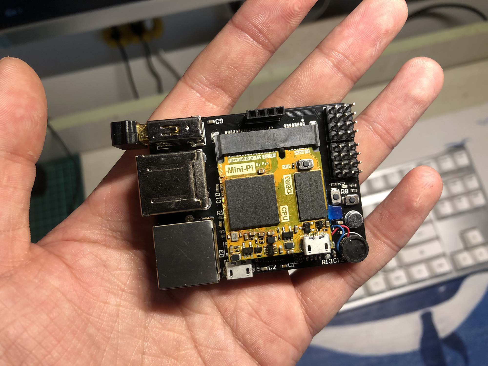
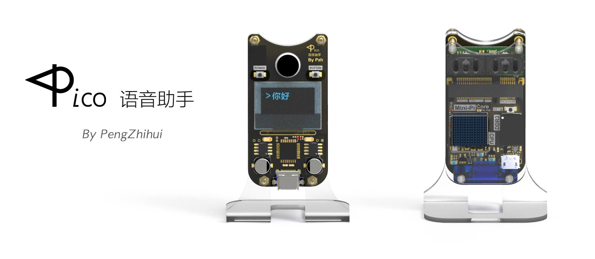
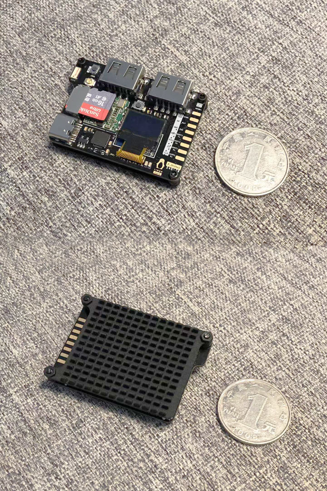

## [Project-Quantum] 超迷你模块化卡片电脑计划

`量子计划`是我从2019年12月开始设计的一个关于自制**超迷你Linux卡片电脑**软硬件开源项目，项目构思和实现的历程比较丰富曲折~其前身是我在两年前做的**MiniPi**：

> 当时准备拿树莓派做一些AI相关好玩的东西，但是对这块别人设计的板子总感觉不是很满意。
>
> 一方面树莓派是面向广大用户的，所以定制化不够，板子形状尺寸配置外设都无法达到理想的要求；另一方面树莓派的性能也确实相对捉急，毕竟成本摆在那里，为了普及这块卡片电脑，不可能用上太贵的SOC（树莓派上面的博通CPU是专门供应给树莓派的）。
>
> 于是为了满足个人的强迫症，也为了学习一下高速PCB的设计制造，决定自己画块ARM核心板玩~

关于这个项目的介绍和板子功能演示可以参考我这篇文章：[如何自制一块“树莓派”--DIY ARM-Linux卡片电脑](http://pengzhihui.xyz/2018/04/08/minipi/)

而那个时候准备做的所谓的好玩项目，就是后来的**迷你语音助手Pico**：

**项目介绍**：[如何自制一个超迷你的语音助手](https://zhuanlan.zhihu.com/p/72896282)

再然后我又发现了这个作品的很多可改进之处：

- 首先Mini-PCIE的封装接口IO数有限，使得大部分的IO都没能从核心板引出
- 其次大家可以发现其实这块核心板的固定方式比较尴尬，由于USB插口处一侧没有螺丝孔位，所以只能靠一个打印的塑料卡扣来固定板子
- 再有就是虽然核心板很小，但是必须加上硕大的底板才能作为完整的卡片电脑使用，而一旦加上底板，整个卡片电脑的尺寸就变得一点也不Mini了

于是去年8月份的时候，我用邮`票孔核心板`+`底板`的方式重新设计了一款卡片电脑，取名为`Linux-Card`

**介绍视频如下↓**

[【升级】自制超迷你Linux卡片电脑“Plus”& 【新项目预告】](https://www.bilibili.com/video/BV1ZJ411t74D/)

### 然后你们以为事情就结束了吗？

并没有！**某男子业余制造卡片电脑得寸进尺，竟还想集成更多功能！**

光增加功能还不算，我掐指一想：既然都已经把核心板压缩到这个程度了，为何不把其他模块和外设也做成邮票孔的形式以实现更紧凑的布局呢？

我们知道软件开发里面有`封装`、`抽象`、`解耦`等概念，我为什么不试试把硬件设计也来个`High-Level-PCB-Design`呢？通过这样模块化的PCB设计，以后我想基于这款卡片电脑做任何项目的时候，岂不是就都能拼积木一般easy了？

**于是【Project Quantum】量子计划就诞生了。**

关于计划更详细的讲解建议看一下我发的这个视频：https://www.bilibili.com/video/BV1q7411h73t/

## 1. 项目文件结构说明

- **Hardware**：量子计划包含了一系列邮票孔形式的超迷你积木模块，目前工程文件里已开放的有：
  - **Quark-Core**：基于全志H3/H5芯片的ARM-Linux核心板模块，引出的外设有SDIO、USBx4、I2Cx2、SPIx2、UARTx3、HDMI、CAMERA、以太网口、GPIO等。
  - **Atom-Shield**：对应于核心板的底板模块，将核心板的几乎所有外设都用上了，自己设计底板的时候可以直接基于Atom进行硬件裁剪。
  - **Gluon-Power**：一个指甲盖大小的电源管理模块，在Atom上有用到，支持锂电池的充放电管理，以及一路5V DC-DC升压和一路3.3V降压输出。
  - **Electron-Arduino**：一个基于ATmega328的协处理器模块，可以直接烧录Arduino的Bootloader作为Arduino板卡使用，非常迷你。
- **Bootloader**：SOM的u-boot源代码，移植自[FriendlyARM](https://github.com/friendlyarm/u-boot.git)的仓库
- **Kernel**： SOM用的主线Linux内核源码，添加了一些自己的驱动，修改了设备树配置，原始仓库是[这个](https://github.com/friendlyarm/linux.git)
- **Image**： 打包好的系统镜像，可以直接烧录到SD里进行启动。
- **Docs**： 相关芯片的Datasheet文档。

#### 各个模块（硬件、软件、镜像）的详细说明可以进入相关文件夹内查看README.md（待持续补充）。

-----

## 记得给本仓库点星星督促我更新！！！